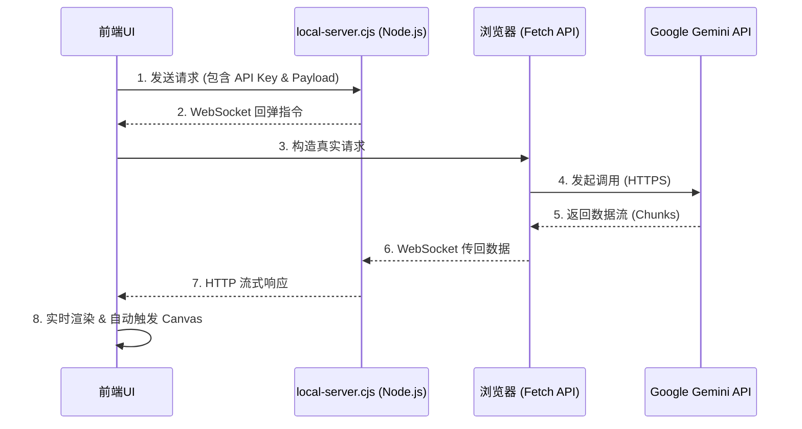

## 1. 项目解析报告

### **1. 概述**

本项目是一个基于 **React** 和 **TypeScript** 构建的、功能强大的 AI 聊天应用，其核心是与 **Google Gemini AI 模型**进行深度集成和交互。项目架构清晰、代码组织良好，并采用了一系列现代前端开发最佳实践。

该项目最引人注目的特点是其**双重运作模式**：一种是直接连接 Google API 的标准模式，另一种是专为本地开发设计的、极其巧妙的**“回弹式”代理模式**，用以解决浏览器跨域（CORS）限制，并支持包括多文件上传在内的复杂场景。

---

### **2. 技术栈与项目结构**

*   #### **技术栈**:
    
    *   **核心框架**: **React 18.3.1** (作为向 React 19 演进的桥接版本，广泛应用并发特性与 Hooks)；**语言**: **TypeScript** (提供覆盖全链路的详尽类型定义)；**构建工具**: **Vite**。
    *   **样式与 UI**: **Tailwind CSS** + **CSS 变量** (实现高度动态的多主题系统)；图标库采用 **Lucide React**。
    *   **AI 服务**: 深度集成 **Google Gemini SDK** (`@google/genai`)，支持 Gemini 3.0 全系列模型及 Imagen 3、TTS、实时 API (WebRTC/WebSocket)。
    *   **持久化层**: 基于原生 **IndexedDB** 的自研封装 (无第三方依赖)，支持 TB 级的聊天记录、大文件及系统日志存储。
    *   **渲染引擎**: 
        *   **Markdown**: `react-markdown` 核心，集成 `remark-gfm` (GitHub 风格) 和 `remark-breaks`。
        *   **公式与图表**: **KaTeX** (数学公式)、**Mermaid** (流程图/甘特图) 以及通过 CDN 引入的 **Viz.js** (Graphviz 关系图)。
        *   **代码高亮**: **Highlight.js** (具备 `detect: true` 自动语言识别能力)。
        *   **安全性**: `dompurify` + `rehype-sanitize` 双重过滤机制。
    *   **高级工具链**: **html2canvas** (长图导出)、**JSZip** (文件夹/压缩包解析)、**Turndown** (HTML 转 Markdown)、**lamejs** (前端音频压缩以优化 Token)。
*   #### **项目结构**:
    
    *   `backend/`: 本地代理与独立运行环境：
        *   `local-server.cjs`: 实现“回弹式”代理的 Node.js 服务器核心。
        *   `server-entry.cjs`: 负责应用打包成 EXE 后的入口引导逻辑。
    *   `components/`: UI 组件体系，采用高度模块化的分组设计：
        *   `chat/`: 聊天核心界面，包含 `ChatInput`（集成录音、文件、斜杠命令）和 `MessageList`。
        - `message/`: 消息渲染核心，支持 Markdown、代码块、图表及 **Grounded Response** (联网引用)。
        - `layout/`: 应用基础布局，包含侧边栏控制及 **PiP (画中画)** 占位符。
        - `modals/`: 功能丰富的交互弹窗，如 **Canvas** 预览、Token 统计、导出管理及录音机。
        - `scenarios/`: 场景/角色市场及编辑器相关组件。
        - `log-viewer/`: 系统级的实时日志与 API 监控面板。
        - `shared/`: 全局复用的原子组件（AudioPlayer, CodeEditor, LoadingDots）。
    *   `constants/`: 应用的“全局配置中心”与 AI 的“系统知识库”：
        *   `appConstants.ts`: 定义应用级默认值（主题、语言、快捷键）及 UI 样式常量。
        *   `modelConstants.ts`: 详尽的模型配置，涵盖从 Gemini 1.5 到 3.0 的全系列参数、思维预算及 TTS/Imagen 选项。
        *   `promptConstants.ts`: 模块化的系统指令集，包含核心的 **Canvas 助手**、深度搜索及边界框识别等复杂 Prompt。
        *   `scenarios/`: 预设的场景库（越狱模式、工具类、角色扮演），为用户提供即开即用的 AI 人设。
        *   `themeConstants.ts`: 定义了高度可定制的主题色值系统（如 Onyx 深色与 Pearl 浅色）。
    *   `contexts/`: 状态管理与上下文分发：
        *   `WindowContext.tsx`: 核心环境上下文。为组件提供当前运行环境的 `window` 和 `document` 对象，确保组件在多窗口、画中画（PiP）模式或独立预览窗口中能正确访问全局 API、注入样式及绑定事件。
    *   `hooks/`: 业务逻辑的“重型”抽象层，按领域驱动划分：
        *   `core/`: 全局状态控制（AppLogic, AppProps）、设备适配及窗口管理。
        *   `message-sender/`: 采用策略模式处理不同类型的请求分发（标准、画布生成、多模态编辑）。
        *   `chat-stream/`: 高性能流式解析引擎，处理思维链、工具调用及实时内容更新。
        *   `file-upload/`: 多策略文件处理，包含浏览器端音频压缩、文件夹解析及上传状态追踪。
        *   `live-api/`: 封装 WebRTC 与 WebSocket，实现毫秒级的实时音视频交互逻辑。
    *   `services/`: 数据与通信服务层：
        *   `api/`: 负责 SDK 客户端初始化及底层的请求配置（BaseApi）。
        *   `geminiService.ts`: 统一的 AI 交互接口封装。
        *   `networkInterceptor.ts`: 核心网络插件，负责 API 代理跳转及 **Vertex AI Express** 适配。
        *   `logService.ts`: 基于 IndexedDB 的持久化日志服务。
    *   `styles/`: 多层次的样式系统：
        *   `main.css`: 应用基础样式中心。定义了基于 Apple 风格的弹性动画变量、全局布局重置、自定义滚动条以及响应式布局的基础配置。
        *   `animations.css`: 预设的交互动画库。包含各类平滑过渡、加载状态及 UI 反馈的 CSS 动画定义。
        *   `markdown.css`: 深度定制的 Markdown 渲染样式。针对 AI 输出的内容进行了优化，涵盖代码高亮、表格排版、公式展示及图表容器的视觉表现。
    *   `types/`: 全链路 TypeScript 类型定义体系：
        *   `chat.ts`: 核心聊天数据模型。定义了消息 (`ChatMessage`)、文件上传状态 (`UploadedFile`)、视频元数据及输入命令的严格类型。
        *   `api.ts`: Gemini API 通信协议定义。涵盖了多模态输入、工具调用（Tool Calling）、生成配置及模型响应的完整 Schema。
        *   `settings.ts`: 应用配置与偏好设置类型。包含模型参数、媒体分辨率、语言翻译映射及全局设置的结构化定义。
        *   `theme.ts`: 主题系统类型。定义了多主题架构下的颜色变量、模式选择及 UI 风格映射。
    *   `utils/`: 支撑应用运行的“动力引擎”，包含大量底层算法与系统级封装：
        *   `db.ts`: 基于原生 IndexedDB 的 Promise 封装，实现了会话、场景、配置及海量日志的原子化持久化。
        *   `apiUtils.ts`: API 密钥管理器。支持多 Key 解析及轮询调度 (Round-robin)，确保请求负载均衡。
        *   `audio/`: 底层音频流处理。包含 Base64/PCM 转换算法及用于实时音视频会话的 AudioWorklet 处理程序。
        *   `audioCompression.ts`: 音频压缩核心。在 Web Worker 中集成 lamejs，将录音实时转换为低比特率 MP3，极大节省 Token 消耗。
        *   `export/`: 多格式导出引擎。支持将聊天导出为 HTML、Markdown、JSON 以及通过 html2canvas 渲染的高清 PNG 长图。
        *   `chatHelpers.ts`: 业务逻辑辅助。处理复杂的 ContentPart 构建（文件引用、YouTube 链接、思维链签名）及会话标题自动生成。
        *   `codeUtils.ts`: 智能代码处理。用于识别 HTML/React 片段并生成可执行的“Canvas”沙盒预览环境。
        *   `folderImportUtils.ts`: 开发者利器。支持一键解析整个项目文件夹或 ZIP 包，自动过滤冗余文件（node_modules等）并构建 ASCII 树状结构作为 AI 上下文。
        *   `fileHelpers.ts`: 通用的文件处理工具，涵盖 Base64 转换、MIME 类型推断及文件大小格式化。
        *   `translations/`: 全球化 i18n 系统。采用模块化结构，为应用提供全方位的多语言支持。
        *   `markdownConfig.ts`: Markdown 渲染策略。集成了复杂的 rehype 插件链，支持公式、图表、SVG 及严苛的安全过滤。
        *   `uiUtils.ts` & `shortcutUtils.ts`: 处理 UI 交互反馈、日期格式化及全局快捷键的绑定逻辑。

---

### **3. 核心运作模式详解**

当用户发送一条消息时，应用内部会触发一套严密的逻辑链路，从 UI 输入到状态持久化，每一步都经过了精心设计。

#### **用户发送消息的内部“连锁反应”**

1.  **输入分发 (Dispatching)**:
    *   用户在 `ChatInput` 提交内容。
    *   `useMessageSender` 充当“调度中心”，根据当前选择的模型（Gemini 1.5, 3.0, Imagen 3, 或 TTS）采用**策略模式**将任务分发给对应的子 Hook：
        *   `useStandardChat`: 处理大多数 Gemini 模型的标准对话。
        *   `useCanvasGenerator`: 专门负责可视化 HTML 应用的重生成或编辑。
        *   `useTtsImagenSender` / `useImageEditSender`: 处理音频和图像生成任务。

2.  **乐观更新 (Optimistic UI Update)**:
    *   在请求发出之前，`useStandardChat` 会立即执行**乐观更新**。
    *   它通过 `updateAndPersistSessions` 向 `IndexedDB` 写入两条消息：用户的原始输入和一条标记为 `isLoading: true` 的模型占位消息。这消除了用户的等待感，让界面瞬间响应。

3.  **智能负载构建 (Payload Preparation)**:
    *   `buildContentParts`: 智能处理多模态附件。它决定是将文件转换为 **Inline Base64**（小文件）还是通过 **Google Files API**（大文件/视频）引用 URI。
    *   `buildGenerationConfig`: 根据设置动态构建配置。对于 **Gemini 3.0**，它会注入 `thinkingConfig`（包含思维预算 `thinkingBudget`）；如果启用了联网，则注入 `googleSearch` 工具。

4.  **代理路由与请求重定向 (Proxy Routing)**:
    *   `geminiService` 调用底层 `baseApi`。
    *   如果开启了“API Proxy”，`getConfiguredApiClient` 会将 SDK 的 `baseUrl` 重定向到本地运行的 `local-server.cjs`（通常是 `http://127.0.0.1:8889`）。
    *   **核心亮点**: 此时会进入“回弹模式”——本地 Node.js 服务接收请求，通过 WebSocket 传回给浏览器执行真实的 `fetch`，从而绕过跨域限制并确保 API 密钥的安全管理。

5.  **原子化流式解析 (Streaming Execution)**:
    *   `useChatStreamHandler` 接管响应流。它不仅处理文本，还处理**复杂的部分 (Parts)**：
        *   `onThoughtChunk`: 实时捕获并追加 **Gemini 3.0 的思维链 (Thoughts)**。
        *   `streamOnPart`: 实时解析文本块、代码执行结果或多模态输出。
    *   为了性能，流式更新期间 `persist` 参数设为 `false`（仅更新内存状态），只有在完成时才执行一次性磁盘持久化。

6.  **收尾、自动化与 Canvas 触发**:
    *   `streamOnComplete`: 汇总 Token 使用情况，计算响应时长，并将最终状态写入 `IndexedDB`。
    *   **Auto-Canvas 自动化**: 如果 AI 返回了复杂的 HTML/JS 代码，且应用开启了 `autoCanvasVisualization`，系统会自动触发 `handleGenerateCanvas`，在侧边栏渲染交互式画布。
    *   **通知系统**: 如果用户切换了标签页，任务完成后会通过系统通知提醒。

---

#### **核心通信模式：回弹式代理 (Bounce Proxy)**

应用不仅支持直连模式，还设计了一套精妙的代理架构以应对复杂的开发环境。

##### **场景：文本 + 多文件上传的高级链路**

这是一个涉及 **N+1 次回弹** 的复杂过程：

1.  **文件预上传 (Stage 1)**:
    *   `useFileUpload` 使用 `Promise.allSettled` 并行处理文件。
    *   每个文件请求通过 `local-server.cjs` 回弹，由浏览器执行真实的 `files.upload` 操作。
2.  **消息发送 (Stage 2)**:
    *   前端收集齐所有文件的 `URI`。
    *   构建最终的聊天 Payload，再次通过代理回弹，向 `streamGenerateContent` 发起最后一次调用。

## 2. 核心功能亮点

#### A. 深度集成的 Gemini 能力

*   **模型支持**：支持 Gemini 全系列，包括最新的 **Gemini 3.0 Pro/Flash**。针对 Gemini 3.0 及 2.5 系列，代码中实现了 **"Thinking Mode" (深度思考/思维链)** 的强制适配，支持可视化思考过程、设置 Token 预算和多种思考等级（Minimal 到 High）。
*   **多模态交互**：
    *   **文本**：支持流式输出、Markdown 渲染、代码高亮。
    *   **图片**：支持 **Imagen 4.0 (Fast/Ultra)** 及 **Imagen 3** 绘图，以及上传图片进行多模态理解。
    *   **音频**：集成了 **TTS (文本转语音)** 和 **ASR (语音转文本)**。支持实时录音，并且在前端使用 `lamejs` 进行 MP3 压缩以节省 Token，内置了 30 余种高品质语音。
    *   **视频**：支持上传视频文件或粘贴 YouTube 链接，支持视频切片（Start/End 时间戳）和帧率控制。
    *   **实时 API (Live API)**：实现了基于 WebSocket/WebRTC 的实时语音和视频交互 (`useLiveAPI`)，支持低延迟打断和基于视频流的实时视觉理解。

#### B. 强大的工具链 (Tools)

项目在 `services/api/baseApi.ts` 中构建了复杂的工具配置：

*   **Google Search (联网搜索)**：支持普通搜索和 **Deep Search (深度搜索)** 模式。
*   **Code Execution (代码执行)**：允许模型编写并运行 Python 代码。
*   **URL Context**：可以直接读取网页内容作为上下文。

#### C. 可视化与“Canvas”模式

*   **智能画布 (Canvas)**：这是一个特色功能，允许 AI 生成交互式的 HTML/JS 应用、**React (TSX/JSX) 组件**、ECharts 图表或 SVG 矢量图。系统内置了专用的 React 运行时沙盒。
*   **沉浸式体验**：提供独立的全屏预览 (`HtmlPreviewModal`) 以及侧边栏实时预览/编辑功能。
*   **图表渲染**：内置了 **Mermaid** (流程图) 和 **Graphviz/Viz.js** (关系图) 的渲染支持。

#### D. 高级文件处理

*   **文件上传策略**：支持两种模式——**Inline (Base64)** 适合小文件，**Files API** 适合大文件（上传到 Google 服务器）。
*   **文件夹/Zip 导入**：前端直接解析文件夹结构或 Zip 包，自动过滤 `node_modules` 等冗余目录，将其转换为 ASCII 树状结构和代码上下文 (`utils/folderImportUtils.ts`)。
*   **Token 计算器**：内置 Token 计算工具，帮助用户精确预估成本。

#### E. 场景与角色扮演 (Scenarios)

*   **预设市场**：内置了多种 Prompt 预设（在 `constants/scenarios/` 中），例如：
    *   **Jailbreak/Unrestricted**：无限制模式（如 FOP, Pyrite）。
    *   **角色扮演**：如 Cyberpunk RPG 游戏、虚拟女友 (Anna)。
    *   **实用工具**：苏格拉底教学、简洁模式、深度推理者。
*   **管理系统**：用户可以创建、编辑、导入、导出自己的场景配置。

#### F. 开发者友好的功能

*   **网络拦截器 (`networkInterceptor.ts`)**：允许用户配置 API 代理地址，解决了国内访问 Google API 的网络问题，并兼容 **Vertex AI Express**。
*   **高级日志系统**：基于 **IndexedDB** 实现了系统级的实时日志与 API 监控面板，支持日志的持久化存储与清理。
*   **数据导出**：支持将聊天记录导出为 JSON、Markdown、HTML 或 **PNG 长图**（通过 `html2canvas` 实现）。

## 3. 代码架构分析

本项目采用了现代前端开发的顶级设计模式，其核心哲学是 **“逻辑与 UI 的彻底解构”**。通过高度领域驱动的 **重 Hook (Heavy Hooks)** 架构，项目实现了极高的代码复用性、可维护性和可测试性。

### **A. 逻辑抽象层 (The Hooks Layer)**

这是应用的大脑。项目并未将逻辑分散在组件中，而是通过多层嵌套和组合的自定义 Hooks 构建了一个强大的业务逻辑引擎。

1.  **消息发送策略模式 (`hooks/message-sender/`)**:
    *   应用通过 `useMessageSender` 作为统一调度中心，根据当前模型能力和任务类型（文本、画布生成、多模态编辑、音视频生成）动态分发任务。
    *   **`useStandardChat`**: 处理 Gemini 全系列模型的标准对话流。
    *   **`useCanvasGenerator`**: 专门负责“Artifacts”风格的 HTML/React 应用生成逻辑。
    *   **`useTtsImagenSender`**: 封装了 Imagen 3/4 绘图与高性能 TTS 语音生成的复杂请求链。

2.  **极致解构的输入控制 (`hooks/chat-input/` & `hooks/chat-input-handlers/`)**:
    *   `ChatInput` 组件的复杂度被拆解到了 10 余个专项 Hook 中：
        *   **状态管理**: `useChatInputState`, `useChatInputLocalState` 分离了全局与本地状态。
        *   **交互逻辑**: `useInputAndPasteHandlers` 处理复杂的富文本粘贴与拖拽；`useKeyboardHandlers` 绑定了大量快捷键。
        *   **属性构建**: `useChatInputPropsBuilder` 动态生成传递给底层 UI 的 Props，实现了视图与逻辑的完美解绑。

3.  **流式解析引擎 (`hooks/chat-stream/`)**:
    *   该模块负责实时解析 Gemini 返回的复杂多部分 (Multi-part) 响应。它不仅处理纯文本，还利用 **`processors.ts`** 中的逻辑实时提取思维链 (Thoughts)、工具调用 (Tool Calls) 和代码执行结果。

4.  **实时交互能力 (`hooks/live-api/` & `hooks/features/`)**:
    *   集成了 **Live API**，通过 WebRTC/WebSocket 实现毫秒级的实时感知逻辑。

### **B. UI 组件层 (The Component Layer)**

组件层遵循“功能内聚”原则，通过模块化分组实现高度的可扩展性。

1.  **消息渲染体系 (`components/message/`)**:
    *   采用了**分块渲染 (Block-based Rendering)** 策略：
        *   **`blocks/`**: 将代码块、Mermaid 流程图、Graphviz 架构图、CSV 表格和工具执行结果视为独立的“块”进行渲染，提供了类似 Claude Artifacts 的沉浸式体验。
        *   **`content/`**: 细化了消息的内部结构，包括支持计时与翻译的 **`thoughts/` (思维链)** 容器、消息页脚及多模态附件展示。
        *   **`grounded-response/`**: 专门用于展示 **Deep Search (深度搜索)** 的引用来源，支持溯源点击。

2.  **交互式画布 (Canvas/Artifacts)**:
    *   通过 `HtmlPreviewModal` 和侧边栏预览，结合 `utils/codeUtils.ts` 的智能识别，实现了代码的即时编译与可视化运行，支持 HTML5、React (TSX) 和各种图表库。

3.  **复杂配置与弹窗 (`components/modals/` & `components/settings/`)**:
    *   设置面板采用了侧边栏导航结构，细分了模型控制、声音配置、安全设置等多个 Section。弹窗系统支持 Token 统计、文件高级配置及多格式导出。

### **C. 服务与基础设施层 (Services & Utils)**

1.  **API 封装中心 (`services/api/`)**:
    *   在 `baseApi.ts` 之之上构建了 `chatApi`、`fileApi` 和 `generationApi`，实现了对 Google Generative AI SDK 的高度定制化封装，支持多 Key 轮询和动态代理切换。

2.  **网络拦截与转发 (`services/networkInterceptor.ts`)**:
    *   这是项目的核心黑科技，通过拦截全局 `fetch`，透明地实现了 **Vertex AI Express** 的适配和**“回弹式代理”**逻辑。

3.  **高性能持久化 (`utils/db.ts`)**:
    *   放弃了体积庞大的外部数据库，直接基于原生 **IndexedDB** 封装了高性能的异步存储层，确保海量聊天记录和日志的秒级读写。

4.  **边缘计算与压缩 (`utils/audioCompression.ts`)**:
    *   在 Web Worker 中利用 `lamejs` 实现音频实时压缩，将计算压力从主线程卸载，同时极大优化了多模态交互的 Token 效率。

## 4. 数据流核心逻辑分析-摘要

本节深入解析应用从用户交互到 API 响应的底层数据流动机制，特别是其独特的“回弹式代理”与高性能资源处理流程。

### **A. “回弹式代理 (Bounce Proxy)” 的底层闭环**

为了解决浏览器的 CORS 限制并确保 API 密钥的安全管理，项目实现了一套精妙的请求转发机制：

1.  **请求拦截与重定向**:
    *   在 `services/api/baseApi.ts` 中，`getConfiguredApiClient` 根据用户设置动态修改 SDK 的 `baseUrl`。
    *   请求被重定向至本地运行的 `local-server.cjs` (Node.js)。

2.  **指令封装与 WebSocket 回弹**:
    *   `local-server.cjs` 接收到 HTTP 请求后，并不直接转发给 Google，而是将其封装为包含 `method`, `headers`, `body_b64` 及唯一 `request_id` 的指令包。
    *   该指令包通过 WebSocket 发送给前端浏览器中的 `cloud-client.tsx`。

3.  **浏览器端真实执行**:
    *   `cloud-client.tsx` 解析指令包，利用浏览器的原生 `fetch` API 向真正的 Google 端点发起请求。
    *   **关键黑科技 - Header 重写**: 对于上传任务，系统会识别 `x-goog-upload-url` 头部，通过注入 `__proxy_host__` 参数（如 `?__proxy_host__=generativelanguage.googleapis.com`）将后续的流式上传引导回代理服务器，实现复杂的“嵌套代理”逻辑。

4.  **响应流的双向回传**:
    *   浏览器获取到 Google 的响应流后，`StreamHandler` 负责将其切片并实时通过 WebSocket 传回本地服务器。
    *   本地服务器将数据块实时写入原始 HTTP 响应流，完成闭环。

### **B. 多维度数据处理与优化**

1.  **多 Key 负载均衡与调度 (`utils/apiUtils.ts`)**:
    *   系统支持配置多个 API 密钥。`apiUtils.ts` 实现了智能调度策略，能够识别各 Key 的配额限制并进行自动切换，确保高并发场景下的可用性。

2.  **音频资源的边缘压缩 (`utils/audioCompression.ts`)**:
    *   **流程**: 用户录音时，原始 PCM 数据通过 `AudioWorklet` 捕获，随后实时传递给运行在 **Web Worker** 中的 `lamejs` 实例。
    *   **收益**: 在边缘端（浏览器后台线程）完成 MP3 编码，极大降低了传输带宽消耗和 Gemini API 的 Token 占用。

3.  **原子化持久化体系 (`utils/db.ts`)**:
    *   应用的所有核心数据（会话、消息、已上传文件元数据、系统日志）均通过 `dbService` 存储在 **IndexedDB** 中。
    *   **流式持久化策略**: 在流式接收消息时，系统优先更新内存状态以保证 UI 流畅度，待流结束或达到特定步长时才触发 IndexedDB 的原子化写入，有效平衡了响应速度与数据安全。

### **C. UI 环境的动态适配 (`contexts/WindowContext.tsx`)**

*   在画中画 (PiP) 或独立预览窗口模式下，数据流不仅包含业务数据，还包含 **“样式流”**。
*   `WindowContext` 负责实时监控环境变化，动态地将主窗口的 CSS 变量、Tailwind 样式表及 KaTeX/Mermaid 的第三方依赖注入到新窗口的 `head` 中，确保跨窗口渲染的一致性。

