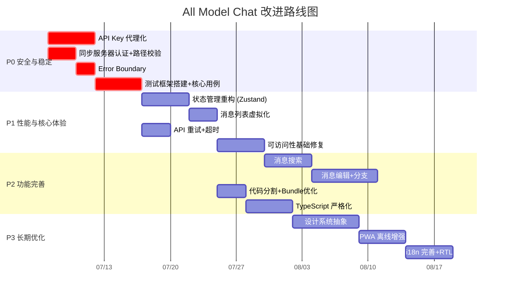

/goal 审查当前这个项目，从前端交互UI及后端处理逻辑两个层面分析，当前项目还存在哪些改进点？把答案 写入到 Next_Step.md 中。

# All Model Chat — 项目改进点全面审查报告

> **审查日期**: 2025-07-05  
> **审查范围**: 前端交互 UI + 后端处理逻辑  
> **项目版本**: v1.9.4  
> **技术栈**: React 18 + TypeScript + Tailwind CSS + Vite + IndexedDB + Express + WebSocket

---

## 执行摘要

本报告对 All Model Chat 项目进行了从前端 UI/交互到后端服务逻辑的全面代码审查。共识别出 **13 大类、70+ 个具体改进点**，涵盖安全性、可访问性、性能优化、架构治理、功能增强等维度。最关键的改进集中在：(1) API Key 安全暴露风险；(2) 同步服务器零认证零鉴权；(3) 无障碍访问全面缺失；(4) 长对话性能瓶颈；(5) 零测试覆盖率。

---

## 目录

- [一、前端交互 UI 层改进点](#一前端交互-ui-层改进点)
  - [1.1 可访问性 (Accessibility)](#11-可访问性-accessibility)
  - [1.2 响应式设计与移动端适配](#12-响应式设计与移动端适配)
  - [1.3 状态管理与渲染性能](#13-状态管理与渲染性能)
  - [1.4 交互模式与用户体验](#14-交互模式与用户体验)
  - [1.5 主题与样式系统](#15-主题与样式系统)
  - [1.6 聊天核心功能缺失](#16-聊天核心功能缺失)
  - [1.7 表单处理与校验](#17-表单处理与校验)
  - [1.8 国际化 (i18n)](#18-国际化-i18n)
  - [1.9 PWA 与离线体验](#19-pwa-与离线体验)
  - [1.10 组件架构](#110-组件架构)
  - [1.11 Markdown 渲染增强](#111-markdown-渲染增强)
- [二、后端处理逻辑层改进点](#二后端处理逻辑层改进点)
  - [2.1 安全性](#21-安全性)
  - [2.2 错误处理与容错](#22-错误处理与容错)
  - [2.3 数据管理与存储](#23-数据管理与存储)
  - [2.4 流式传输与聊天逻辑](#24-流式传输与聊天逻辑)
  - [2.5 类型安全](#25-类型安全)
  - [2.6 网络拦截器与日志](#26-网络拦截器与日志)
  - [2.7 同步服务器](#27-同步服务器)
  - [2.8 Service Worker](#28-service-worker)
  - [2.9 音频处理](#29-音频处理)
  - [2.10 构建与工程化](#210-构建与工程化)
  - [2.11 代码组织与 DRY 原则](#211-代码组织与-dry-原则)
  - [2.12 Live API 与实时功能](#212-live-api-与实时功能)
  - [2.13 环境与配置管理](#213-环境与配置管理)
- [三、改进优先级矩阵](#三改进优先级矩阵)
- [四、推荐实施路线图](#四推荐实施路线图)

---

## 一、前端交互 UI 层改进点

### 1.1 可访问性 (Accessibility)

> [!CAUTION]
> 可访问性缺失是最严重的前端问题，可能导致部分用户完全无法使用应用。

| # | 改进点 | 涉及文件 | 严重程度 |
|---|--------|----------|----------|
| F-01 | **交互元素缺少 ARIA 标签** — 纯图标按钮（发送、附件、语音、模型切换等）没有 `aria-label` 属性，屏幕阅读器用户无法理解按钮功能 | `components/chat/ChatInputArea.tsx`, `components/header/HeaderBar.tsx`, `components/sidebar/HistorySidebar.tsx` | 🔴 高 |
| F-02 | **模态框焦点管理缺失** — 模态框打开时焦点未被锁定(focus trap)；关闭后焦点不会返回触发元素 | `components/modals/SettingsModal.tsx`, `components/modals/ScenarioModal.tsx`, `components/modals/HtmlPreviewModal.tsx` | 🔴 高 |
| F-03 | **键盘导航不支持** — 侧边栏会话列表、斜杠命令下拉、场景卡片均无法通过键盘操作(↑↓、Enter、Esc) | `components/sidebar/HistorySidebar.tsx`, `components/chat/ChatInputArea.tsx`, `components/scenarios/ScenarioSelector.tsx` | 🔴 高 |
| F-04 | **缺少 "跳转到主内容" 链接** — 无 Skip Navigation Link | `index.html` | 🟡 中 |
| F-05 | **部分主题色彩对比度不足** — 某些主题组合未达到 WCAG AA 标准 (4.5:1) | `constants/themeConstants.ts` | 🟡 中 |
| F-06 | **不尊重 `prefers-reduced-motion`** — 动画未提供减弱动画的媒体查询适配 | `styles/animations.css` | 🟡 中 |

**建议措施**：
- 为所有纯图标按钮添加 `aria-label`
- 引入 `focus-trap-react` 实现模态框焦点陷阱
- 在列表类组件中实现键盘导航 handler
- 在 `animations.css` 中添加 `@media (prefers-reduced-motion: reduce)` 查询

---

### 1.2 响应式设计与移动端适配

| # | 改进点 | 涉及文件 | 严重程度 |
|---|--------|----------|----------|
| F-07 | **移动端布局优化不足** — 侧边栏在移动端只是简单显隐，未使用底部抽屉(Bottom Sheet)或手势交互 | `components/layout/AppLayout.tsx` | 🟡 中 |
| F-08 | **输入区域移动端拥挤** — 多按钮输入栏在小屏幕下排列拥挤，附件预览区域可能溢出 | `components/chat/ChatInputArea.tsx` | 🟡 中 |
| F-09 | **`useDevice.ts` 检测能力未充分利用** — 已有 `isMobile` 检测但多数组件未据此渲染移动端专属布局 | `hooks/useDevice.ts` | 🟢 低 |
| F-10 | **缺少触控交互优化** — 无滑动打开/关闭侧边栏、长按消息弹出菜单、图片双指缩放等手势 | 全局 | 🟡 中 |

**建议措施**：
- 移动端使用 Bottom Sheet 替代侧边栏
- 实现滑动手势 (`onTouchStart/onTouchMove/onTouchEnd` 在 `App.tsx` 中已有基础框架，但需完善)
- 输入工具栏在移动端折叠为更多菜单

---

### 1.3 状态管理与渲染性能

> [!WARNING]
> 长对话场景下，当前架构会导致严重的性能退化。

| # | 改进点 | 涉及文件 | 严重程度 |
|---|--------|----------|----------|
| F-11 | **严重的 Prop Drilling** — 整个应用仅一个 `WindowContext`，所有全局状态通过 props 层层传递。`useAppLogic` 返回一个巨型对象，通过 `useAppProps` 分发 | `App.tsx`, `hooks/app/useAppLogic.ts`, `hooks/app/useAppProps.ts` | 🔴 高 |
| F-12 | **消息列表未虚拟化** — 所有消息全部渲染在 DOM 中，百条以上对话将严重卡顿 | `components/message/MessageList.tsx` | 🔴 高 |
| F-13 | **缺少 `React.memo` / `useMemo` 优化** — `MessageItem` 组件未 memo 化，Markdown 渲染未缓存，每次新消息到达全列表重渲染 | `components/message/MessageItem.tsx`, `components/message/MessageList.tsx` | 🟡 中 |
| F-14 | **`useAppLogic.ts` 过于庞大** — 单个 hook 300 行，承担了设置、事件、导出、建议、模型等全部逻辑 | `hooks/app/useAppLogic.ts` (12,581 bytes) | 🟡 中 |

**建议措施**：
- 引入 `Zustand` 或额外 `React.Context` 消除 prop drilling
- 使用 `@tanstack/react-virtual` 实现消息列表虚拟滚动
- 对 `MessageItem` 使用 `React.memo`，对 Markdown 渲染结果使用 `useMemo`
- 将 `useAppLogic` 拆分为更细粒度的 hooks

---

### 1.4 交互模式与用户体验

| # | 改进点 | 涉及文件 | 严重程度 |
|---|--------|----------|----------|
| F-15 | **骨架屏/加载状态不完善** — 会话历史加载、设置加载、场景加载时缺少骨架屏或加载指示器 | 多处 | 🟡 中 |
| F-16 | **空状态设计不够友好** — 空对话和空历史记录页面缺少引导性内容(插图、建议 prompt) | `components/message/MessageList.tsx`, `components/sidebar/HistorySidebar.tsx` | 🟢 低 |
| F-17 | **破坏性操作缺少确认** — 删除会话、清空全部数据、重置设置等操作可能缺少确认弹窗 | `components/sidebar/HistorySidebar.tsx`, `components/settings/SettingsModal.tsx` | 🟡 中 |
| F-18 | **无撤销/重做机制** — 删除消息或会话后没有 "撤销" toast (类似 Gmail 的 "Undo") | 全局 | 🟢 低 |
| F-19 | **AI 回复前无 "思考中" 指示器** — 发送消息后到接收第一个 token 之间，缺少视觉反馈 | `components/message/MessageList.tsx` | 🟡 中 |
| F-20 | **使用 `alert()` 弹窗** — 导出失败等场景使用原生 `alert()` 而非自定义 Toast 组件 | `hooks/app/useAppLogic.ts` L136 | 🟢 低 |

**建议措施**：
- 实现统一的 Toast/Notification 组件替代 `alert()`
- 为所有异步加载添加骨架屏
- 破坏性操作前显示确认 Modal
- 实现 "Thinking…" 动画指示器

---

### 1.5 主题与样式系统

| # | 改进点 | 涉及文件 | 严重程度 |
|---|--------|----------|----------|
| F-21 | **主题切换无过渡动画** — 切换主题时颜色瞬间变化，体验生硬 | `constants/themeConstants.ts` | 🟢 低 |
| F-22 | **主题数量多但未分类** — `themeConstants.ts` 11KB，大量主题缺少分组（亮色/暗色/高对比度/彩色） | `constants/themeConstants.ts` | 🟢 低 |
| F-23 | **样式方案混用** — 同时使用 Tailwind 内联类、自定义 CSS 文件 (`main.css`, `markdown.css`, `animations.css`) 和行内样式，缺乏一致性 | 多处 | 🟡 中 |
| F-24 | **未自动检测系统主题** — 不根据 `prefers-color-scheme` 自动匹配初始亮/暗主题 | 全局 | 🟢 低 |

---

### 1.6 聊天核心功能缺失

> [!IMPORTANT]
> 以下功能在主流 AI 聊天应用中均已标配，缺失会显著影响竞争力。

| # | 改进点 | 说明 | 严重程度 |
|---|--------|------|----------|
| F-25 | **无消息搜索功能** | 无法在当前对话或全部对话中搜索消息内容 | 🟡 中 |
| F-26 | **无消息编辑功能** | 用户无法编辑已发送的消息并重新生成回复 | 🟡 中 |
| F-27 | **无消息分支/分叉** | 重新生成回复时，之前的回复被丢弃，无法像 ChatGPT 那样在多个回复版本间切换 | 🟡 中 |
| F-28 | **无回复质量反馈** | 用户无法对 AI 回复进行 👍/👎 评价 | 🟢 低 |
| F-29 | **无消息收藏/置顶** | 无法标记重要消息以便后续查找 | 🟢 低 |
| F-30 | **无对话分享** | 无法通过链接或格式化导出分享对话 | 🟢 低 |
| F-31 | **无上下文窗口指示器** | 用户不知道已使用了多少模型上下文窗口容量 | 🟡 中 |
| F-32 | **无 Token 费用估算** | 虽有 token 计数逻辑 (`useTokenCountLogic.ts`) 但未显著展示费用估算 | 🟢 低 |
| F-33 | **无会话拖拽排序** | 侧边栏会话列表不支持拖拽重排 | 🟢 低 |

---

### 1.7 表单处理与校验

| # | 改进点 | 涉及文件 | 严重程度 |
|---|--------|----------|----------|
| F-34 | **设置表单缺少输入校验** — API Key 格式、Temperature (0-2)、Max Tokens 等数值范围未做前端校验，无视觉反馈 | `components/settings/SettingsModal.tsx` | 🟡 中 |
| F-35 | **设置无自动保存** — 可考虑实现 debounce 自动保存机制 | 同上 | 🟢 低 |

---

### 1.8 国际化 (i18n)

| # | 改进点 | 涉及文件 | 严重程度 |
|---|--------|----------|----------|
| F-36 | **i18n 覆盖不完整** — 翻译基础设施存在 (`utils/translations.ts`, `utils/translations/`) 但部分 UI 字符串仍硬编码 | 多处 | 🟡 中 |
| F-37 | **语言切换入口不明显** — 若设置中无醒目的语言选择器，用户可能不知道可以切换语言 | 设置界面 | 🟢 低 |
| F-38 | **不支持 RTL 布局** — 无 `dir="rtl"` 支持，阿拉伯语/希伯来语等语言布局会错乱 | 全局 | 🟢 低 |

---

### 1.9 PWA 与离线体验

| # | 改进点 | 涉及文件 | 严重程度 |
|---|--------|----------|----------|
| F-39 | **离线支持不完善** — 无专用离线页面、无离线时查看已缓存对话的能力、无消息排队发送 | `sw.js`, `manifest.json` | 🟡 中 |
| F-40 | **无自定义安装提示** — 缺少 "添加到主屏幕" 的引导性 PWA 安装提示 | 全局 | 🟢 低 |
| F-41 | **新版本无更新通知** — 新的 Service Worker 版本可用时不通知用户刷新 | `sw.js` | 🟡 中 |

---

### 1.10 组件架构

| # | 改进点 | 涉及文件 | 严重程度 |
|---|--------|----------|----------|
| F-42 | **无统一设计系统/组件库** — 按钮、输入框、模态框、Toast、Tooltip 等基础组件未抽象为可复用的设计系统 | 全局 | 🟡 中 |
| F-43 | **无组件文档/Storybook** — 无法独立预览和测试组件 | 全局 | 🟢 低 |
| F-44 | **图标系统碎片化** — `components/icons/` 中的 SVG 图标组件可能未统一尺寸/颜色 API | `components/icons/` | 🟢 低 |
| F-45 | **无图片懒加载** — 上传的图片未使用 `loading="lazy"` 或缩略图优化 | `components/message/` | 🟡 中 |

---

### 1.11 Markdown 渲染增强

| # | 改进点 | 涉及文件 | 严重程度 |
|---|--------|----------|----------|
| F-46 | **代码高亮主题不随应用主题联动** — 切换应用主题时，代码块的 highlight.js 主题可能不匹配 | `index.html` (L21-24), `utils/markdownConfig.ts` | 🟢 低 |
| F-47 | **无链接预览卡片** — 消息中的 URL 仅渲染为纯链接，无 Open Graph 预览 | `components/message/` | 🟢 低 |

---

## 二、后端处理逻辑层改进点

### 2.1 安全性

> [!CAUTION]
> API Key 暴露和同步服务器零认证是最严重的安全隐患，必须优先修复。

| # | 改进点 | 涉及文件 | 严重程度 |
|---|--------|----------|----------|
| B-01 | **API Key 客户端暴露** — API Key 存储在 `localStorage`，通过客户端 `fetch` 直接传给 `generativelanguage.googleapis.com`，任何页面脚本均可窃取 | `services/api/baseApi.ts` L14-53, `services/api/chatApi.ts` | 🔴 严重 |
| B-02 | **`.env.local` 仅为占位符** — 包含 `VITE_GEMINI_API_KEY=Your_API_Key`，实际运行时使用 localStorage 中的 Key，两套机制并存造成混淆 | `.env.local`, `vite.config.ts` L31 | 🟡 中 |
| B-03 | **无输入消毒** — 用户输入未经消毒直接传给 Gemini API，存在 Prompt Injection 风险 | `utils/chatHelpers.ts`, `hooks/useMessageSender.ts` | 🟡 中 |
| B-04 | **同步服务器零认证** — 无任何认证或鉴权机制，任何可达服务器的人都能读写全部数据 | `backend/sync-server.cjs` 全文 | 🔴 严重 |
| B-05 | **CORS 策略过于宽松** — `Access-Control-Allow-Origin: *` 允许任何域的跨域请求 | `backend/sync-server.cjs` L202 | 🔴 高 |
| B-06 | **路径穿越风险** — 客户端请求中的文件路径未做安全校验，攻击者可构造 `../../etc/passwd` 等路径 | `backend/sync-server.cjs` L126-130, L163-176 | 🔴 高 |
| B-07 | **请求体大小限制过高** — POST `/push` 端点允许 200MB 的请求体 (`express.json({ limit: '200mb' })`)，易被滥用 | `backend/sync-server.cjs` L238 | 🟡 中 |
| B-08 | **无 HTTPS 支持** — HTTP 和 WebSocket 服务均无 TLS 加密 | `backend/sync-server.cjs`, `server.cjs` | 🟡 中 |

**建议措施**：
- 将 API 调用路由通过后端代理，Key 仅存储于服务端
- 为同步服务器添加 Token 认证中间件
- 使用 `path.resolve()` + 白名单验证来防止路径穿越
- 收紧 CORS 策略为特定允许的 origin
- 降低请求体限制到合理值（如 10MB）

---

### 2.2 错误处理与容错

| # | 改进点 | 涉及文件 | 严重程度 |
|---|--------|----------|----------|
| B-09 | **API 调用无重试机制** — 网络瞬断或 5xx 错误时直接失败，无指数退避重试 | `services/api/chatApi.ts`, `services/api/baseApi.ts` | 🔴 高 |
| B-10 | **请求无超时控制** — Fetch 调用无 `AbortController` 超时，挂起的请求会无限阻塞 | `services/api/chatApi.ts` L86-90 | 🔴 高 |
| B-11 | **错误消息不友好** — 错误被 `console.error` 后重新抛出，用户看到的是原始错误字符串而非友好提示 | `services/api/chatApi.ts` L143-145, `hooks/app/useAppLogic.ts` L136 | 🟡 中 |
| B-12 | **无 React Error Boundary** — 整个应用没有 Error Boundary 组件，任何未捕获异常将导致白屏 | 全局 | 🔴 高 |
| B-13 | **同步服务器空 catch 块** — 多处使用 `catch (e) {}` 静默吞没错误，掩盖了潜在问题 | `backend/sync-server.cjs` L98, L115, L189 | 🟡 中 |

**建议措施**：
- 实现 `fetchWithRetry(url, options, { maxRetries: 3, backoffMs: 1000 })` 工具函数
- 为所有 API 调用添加 `AbortController` 超时 (普通请求 30s, 流式 120s)
- 在 `App.tsx` 中包裹 `<ErrorBoundary>` 并显示友好的错误回退 UI
- 创建集中式错误处理工具，将 API 错误码映射为用户友好的翻译字符串

---

### 2.3 数据管理与存储

| # | 改进点 | 涉及文件 | 严重程度 |
|---|--------|----------|----------|
| B-14 | **IndexedDB 无数据迁移策略** — `onupgradeneeded` 只创建不存在的 store，无法处理跨版本的 schema 变更（如字段重命名、索引重建） | `utils/db.ts` L26-49 | 🟡 中 |
| B-15 | **从 IndexedDB 加载的数据无校验** — 读取的数据直接使用，未验证 schema 完整性，损坏或过时数据可能导致运行时崩溃 | `utils/db.ts` 全文 | 🟡 中 |
| B-16 | **大型 JSON 文件全量加载** — `storage/scenarios.json` (155KB) 整体加载到内存，应考虑按需加载 | `storage/scenarios.json` | 🟢 低 |
| B-17 | **存储策略不统一** — 同时使用 IndexedDB (`db.ts`) 和文件 JSON (`storage/`) 两套存储，缺乏清晰的分层 | `utils/db.ts`, `storage/` | 🟡 中 |

**建议措施**：
- 实现版本化的 migration runner：每个版本增量一个 migration 函数
- 引入 `Zod` 在加载时验证数据 schema
- 场景数据按分类懒加载
- 统一存储架构：IndexedDB 为运行时数据，文件 JSON 仅为默认配置/种子数据

---

### 2.4 流式传输与聊天逻辑

| # | 改进点 | 涉及文件 | 严重程度 |
|---|--------|----------|----------|
| B-18 | **流式处理缺少背压控制** — 从响应体读取数据无背压机制，超长回复可能导致内存峰值 | `services/api/chatApi.ts` L92-142 | 🟡 中 |
| B-19 | **无消息缓冲/批量更新** — 流式 token 到达时直接触发 state 更新，高频率 `setState` 可能导致帧率下降 | `hooks/chat-stream/processors.ts` | 🟡 中 |
| B-20 | **AbortController 清理不一致** — 部分 hooks 中 AbortController 在组件卸载时清理不完整 | `hooks/chat-stream/`, `hooks/message-sender/` | 🟡 中 |

**建议措施**：
- 使用 `requestAnimationFrame` 或 `queueMicrotask` 批量合并 state 更新
- 确保所有 `useEffect` 的 cleanup 函数中调用 `abortController.abort()`

---

### 2.5 类型安全

| # | 改进点 | 涉及文件 | 严重程度 |
|---|--------|----------|----------|
| B-21 | **大量使用 `any` 类型** — `config: any` 出现在核心 API 函数签名中，丧失了 TypeScript 类型保护 | `services/geminiService.ts` L71/103, `services/api/baseApi.ts` L108/152, `services/api/chatApi.ts` L32/44 | 🟡 中 |
| B-22 | **类型定义分散** — 根目录 `types.ts` 与 `types/` 目录并存，`types.ts` 仅含 `ChatSession` 和 `GroupedSessions`，应合并 | `types.ts`, `types/` 目录 | 🟢 低 |
| B-23 | **导出函数缺少返回类型标注** — 多数 hooks 和 utility 函数未显式标注返回类型 | 多处 | 🟢 低 |
| B-24 | **使用 `@ts-ignore` 抑制错误** — `chatApi.ts` L34, L108 使用 `@ts-ignore` 绕过类型检查 | `services/api/chatApi.ts` | 🟡 中 |

**建议措施**：
- 为 Gemini API config 创建强类型接口 `GenerationConfig`，替代 `any`
- 合并 `types.ts` 到 `types/` 目录
- 启用 `tsconfig.json` 中的 `noImplicitAny: true`

---

### 2.6 网络拦截器与日志

| # | 改进点 | 涉及文件 | 严重程度 |
|---|--------|----------|----------|
| B-25 | **Monkey-patch `window.fetch` 的脆弱方案** — 全局覆写 `fetch` 可能与第三方库冲突，HMR 时可能出现嵌套覆写 | `services/networkInterceptor.ts` L57-167 | 🟡 中 |
| B-26 | **日志服务内存增长** — 内存中 log 数组在长时间会话中可能增长显著 | `services/logService.ts` | 🟢 低 |

**建议措施**：
- 考虑使用自定义 fetch wrapper（如 `apiFetch()`）替代全局拦截
- 日志服务使用环形缓冲区并定期写入 IndexedDB

---

### 2.7 同步服务器

| # | 改进点 | 涉及文件 | 严重程度 |
|---|--------|----------|----------|
| B-27 | **无速率限制** — 无任何请求频率控制 | `backend/sync-server.cjs` | 🟡 中 |
| B-28 | **JSON 解析错误处理不完善** — 读取 JSON 文件失败时（格式损坏）仅返回 null，不记录详细错误 | `backend/sync-server.cjs` L163-176 | 🟡 中 |
| B-29 | **WebSocket 消息未验证** — 接收的 WebSocket 消息仅做 JSON 解析，不验证消息结构和类型 | `backend/sync-server.cjs` L34-43 | 🟡 中 |
| B-30 | **无优雅关闭机制** — 服务器进程没有 `SIGTERM`/`SIGINT` 处理程序来清理连接和刷新数据 | `backend/sync-server.cjs` | 🟡 中 |

**建议措施**：
- 引入 `express-rate-limit` 中间件
- 添加 JSON Schema 验证 (如 `ajv`)
- 注册 `process.on('SIGTERM', ...)` 优雅关闭
- 验证 WebSocket 消息的 `type` 字段为白名单值

---

### 2.8 Service Worker

| # | 改进点 | 涉及文件 | 严重程度 |
|---|--------|----------|----------|
| B-31 | **缓存策略不够精细** — 当前使用 Stale-While-Revalidate 策略对所有 GET 请求，API 请求直接透传，但未区分静态资源和动态内容 | `sw.js` L84-104 | 🟡 中 |
| B-32 | **缓存版本号硬编码** — `CACHE_NAME` 中版本号 `v1.9.4` 需手动同步更新 | `sw.js` L3 | 🟢 低 |
| B-33 | **`self.skipWaiting()` 在 install 中自动调用** — 同时在 `install` 事件和 `message` 事件中处理 `skipWaiting`，install 中的自动跳过可能导致用户在使用中突然切换到新版本 | `sw.js` L49, L35-38 | 🟡 中 |

**建议措施**：
- 移除 install 事件中的 `self.skipWaiting()`，仅通过用户交互触发
- 静态资源使用 Cache First，HTML 使用 Network First
- 从 `package.json` 自动注入版本号到 SW

---

### 2.9 音频处理

| # | 改进点 | 涉及文件 | 严重程度 |
|---|--------|----------|----------|
| B-34 | **音频格式未验证** — 音频数据处理前不验证输入格式、采样率、通道数 | `utils/audioCompression.ts` | 🟢 低 |
| B-35 | **AudioContext 资源释放不确定** — `AudioContext` 和相关资源可能未正确调用 `.close()` | `utils/audioCompression.ts`, `hooks/useAudioRecorder.ts` | 🟡 中 |

---

### 2.10 构建与工程化

> [!IMPORTANT]
> 零测试覆盖率是工程质量最大的隐患。

| # | 改进点 | 涉及文件 | 严重程度 |
|---|--------|----------|----------|
| B-36 | **零测试基础设施** — `package.json` 中无测试框架依赖(jest/vitest/testing-library)、无测试脚本、无任何测试文件 | `package.json` | 🔴 高 |
| B-37 | **无 ESLint 配置** — 缺少代码质量静态分析工具 | 根目录 | 🟡 中 |
| B-38 | **无 CI/CD 配置** — 无 GitHub Actions 或其他自动化构建/测试/部署流水线 | 根目录 | 🟡 中 |
| B-39 | **无 Bundle 分析与优化** — Vite 配置中无手动 chunk 拆分、无 `rollup-plugin-visualizer` | `vite.config.ts` | 🟡 中 |
| B-40 | **未做代码分割** — 设置模态框、场景模态框、HTML 预览、日志查看器等重型模块未使用 `React.lazy` + `Suspense` | 全局 | 🟡 中 |
| B-41 | **无 Web Vitals 监控** — 未集成 Core Web Vitals (LCP, INP, CLS) 性能指标采集 | 全局 | 🟢 低 |

**建议措施**：
- 引入 `vitest` + `@testing-library/react`，优先为核心流程编写测试
- 添加 `.eslintrc.cjs` 配合 `@typescript-eslint`
- 配置 GitHub Actions: lint → test → build → deploy
- 在 `vite.config.ts` 中配置 `manualChunks` 拆分大型依赖

---

### 2.11 代码组织与 DRY 原则

| # | 改进点 | 涉及文件 | 严重程度 |
|---|--------|----------|----------|
| B-42 | **`hooks/` 目录过于扁平** — 25 个独立 hook 文件 + 11 个子目录混在同一级，无清晰的按功能域组织 | `hooks/` 目录 | 🟡 中 |
| B-43 | **消息发送逻辑重复** — 分散在 `useMessageSender.ts`、`hooks/message-sender/useStreamMessageSender.ts`、`hooks/message-sender/useNonStreamMessageSender.ts` 中 | 上述文件 | 🟡 中 |
| B-44 | **文件处理逻辑重复** — 分散在 `useFileHandling.ts`、`useFileUpload.ts`、`hooks/file-upload/`、`useFileDragDrop.ts` 中 | 上述文件 | 🟡 中 |
| B-45 | **`chatHelpers.ts` 过于臃肿** — 11,697 字节包含多个不相关的工具函数 | `utils/chatHelpers.ts` | 🟡 中 |
| B-46 | **Proxy URL 处理逻辑重复** — localhost→LAN hostname 的自动修正逻辑在 `networkInterceptor.ts` L30-44 和 `baseApi.ts` L68-81 中重复实现 | 上述两个文件 | 🟢 低 |

**建议措施**：
- 按功能域重组 hooks：`hooks/chat/`, `hooks/media/`, `hooks/data/`, `hooks/ui/`
- 将消息发送逻辑抽象为 Strategy 模式
- 拆分 `chatHelpers.ts` 为 `messageFormatUtils.ts`, `conversationUtils.ts` 等
- 提取 `normalizeLocalhostUrl()` 公共函数

---

### 2.12 Live API 与实时功能

| # | 改进点 | 涉及文件 | 严重程度 |
|---|--------|----------|----------|
| B-47 | **Live API 无自动重连** — WebSocket/流式连接断开后无指数退避重连机制 | `hooks/useLiveAPI.ts`, `hooks/live-api/` | 🟡 中 |
| B-48 | **无心跳/保活机制** — 无法检测静默断开的连接 | 同上 | 🟡 中 |

---

### 2.13 环境与配置管理

| # | 改进点 | 涉及文件 | 严重程度 |
|---|--------|----------|----------|
| B-49 | **API 端点硬编码** — Gemini API 的 host 地址硬编码在代码中 | `services/networkInterceptor.ts` L7, `sw.js` L4 | 🟢 低 |
| B-50 | **无环境区分** — 开发/预发/生产环境无差异化配置 | 全局 | 🟡 中 |

---

## 三、改进优先级矩阵

将所有改进点按 **影响 × 紧急度** 分为四个象限：

### 🔴 P0 — 立即修复 (安全与稳定性)

| 编号 | 改进点 | 分类 |
|------|--------|------|
| B-01 | API Key 客户端暴露 | 安全 |
| B-04 | 同步服务器零认证 | 安全 |
| B-05 | CORS 策略过于宽松 | 安全 |
| B-06 | 路径穿越风险 | 安全 |
| B-12 | 无 React Error Boundary | 稳定性 |
| B-36 | 零测试基础设施 | 工程质量 |

### 🟠 P1 — 近期优化 (性能与核心体验)

| 编号 | 改进点 | 分类 |
|------|--------|------|
| F-11 | Prop Drilling 严重 | 架构 |
| F-12 | 消息列表未虚拟化 | 性能 |
| B-09 | API 调用无重试机制 | 容错 |
| B-10 | 请求无超时控制 | 容错 |
| F-01 | 交互元素缺 ARIA 标签 | a11y |
| F-02 | 模态框焦点管理缺失 | a11y |
| F-03 | 键盘导航不支持 | a11y |

### 🟡 P2 — 中期改进 (功能完善)

| 编号 | 改进点 | 分类 |
|------|--------|------|
| F-25 | 消息搜索功能 | 功能 |
| F-26 | 消息编辑功能 | 功能 |
| F-27 | 消息分支/分叉 | 功能 |
| F-31 | 上下文窗口指示器 | 功能 |
| B-14 | IndexedDB 数据迁移策略 | 数据 |
| B-21 | 消除 `any` 类型 | 类型安全 |
| B-37 | ESLint 配置 | 工程化 |
| B-40 | 代码分割 (React.lazy) | 性能 |

### 🟢 P3 — 长期优化 (锦上添花)

| 编号 | 改进点 | 分类 |
|------|--------|------|
| F-28~F-30 | 回复反馈、收藏、分享 | 功能 |
| F-21~F-24 | 主题动画、分类、系统检测 | UI |
| F-38 | RTL 布局支持 | i18n |
| F-43 | Storybook 组件文档 | 工程化 |
| B-41 | Web Vitals 监控 | 性能 |

---

## 四、推荐实施路线图

### 快速胜利 (Quick Wins)

以下改进实施成本低但效果立竿见影，建议作为第一批实施：

1. ✅ 为所有图标按钮添加 `aria-label` (< 2h)
2. ✅ 在 `App.tsx` 中添加 `<ErrorBoundary>` (< 1h)
3. ✅ 在 `animations.css` 中添加 `prefers-reduced-motion` 查询 (< 30min)
4. ✅ 为同步服务器添加简单的 token 认证中间件 (< 2h)
5. ✅ 添加路径穿越防护 (`path.resolve` + 白名单检查) (< 1h)
6. ✅ 为 API 调用添加 `AbortController` 超时 (< 2h)
7. ✅ 合并根目录 `types.ts` 到 `types/` 目录 (< 30min)
8. ✅ 用 Toast 组件替代 `alert()` (< 2h)

---

> **审查结论**: All Model Chat 作为一个功能丰富的 Gemini 多模型聊天客户端，在核心聊天能力、多模型支持、主题系统、多媒体处理等方面已有扎实的基础。但在**安全性**（API Key 暴露、零认证同步服务器）、**工程质量**（零测试覆盖、无 lint）和**可访问性**（ARIA、键盘导航）三个维度存在系统性缺陷，建议按上述优先级矩阵分阶段修复。
