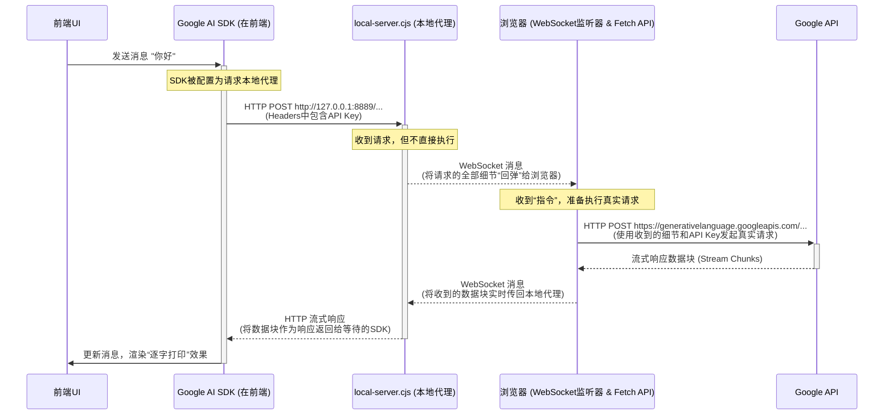
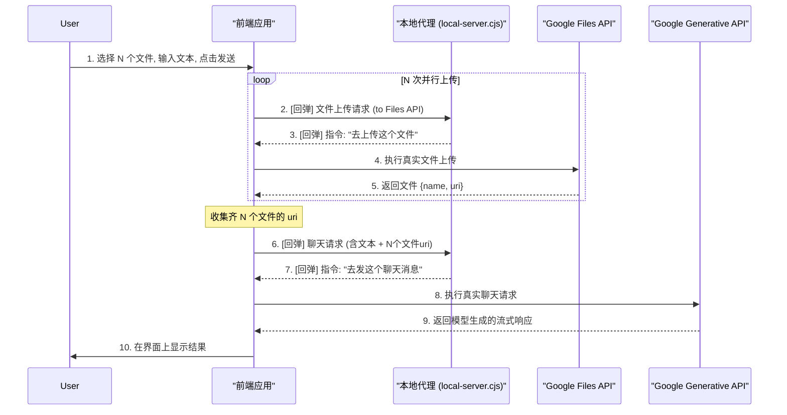

### 1. 项目解析报告

**1. 概述**

本项目是一个基于 **React** 和 **TypeScript** 构建的、功能强大的 AI 聊天应用，其核心是与 **Google Gemini AI 模型**进行深度集成和交互。项目架构清晰、代码组织良好，并采用了一系列现代前端开发最佳实践。

该项目最引人注目的特点是其**双重运作模式**：一种是直接连接 Google API 的标准模式，另一种是专为本地开发设计的、极其巧妙的**“回弹式”代理模式**，用以解决浏览器跨域（CORS）限制，并支持包括多文件上传在内的复杂场景。

---

**2. 技术栈与项目结构**

*   **技术栈**:
    *   **核心框架**: **React 18.3.1** (作为向 React 19 演进的桥接版本，广泛应用并发特性与 Hooks)；**语言**: **TypeScript** (提供覆盖全链路的详尽类型定义)；**构建工具**: **Vite**。
    *   **样式与 UI**: **Tailwind CSS** + **CSS 变量** (实现高度动态的多主题系统)；图标库采用 **Lucide React**。
    *   **AI 服务**: 深度集成 **Google Gemini SDK** (`@google/genai`)，支持 Gemini 3.0 全系列模型及 Imagen 3、TTS、实时 API (WebRTC/WebSocket)。
    *   **持久化层**: 基于原生 **IndexedDB** 的自研封装 (无第三方依赖)，支持 TB 级的聊天记录、大文件及系统日志存储。
    *   **渲染引擎**: 
        *   **Markdown**: `react-markdown` 核心，集成 `remark-gfm` (GitHub 风格) 和 `remark-breaks`。
        *   **公式与图表**: **KaTeX** (数学公式)、**Mermaid** (流程图/甘特图) 以及通过 CDN 引入的 **Viz.js** (Graphviz 关系图)。
        *   **代码高亮**: **Highlight.js** (具备 `detect: true` 自动语言识别能力)。
        *   **安全性**: `dompurify` + `rehype-sanitize` 双重过滤机制。
    *   **高级工具链**: **html2canvas** (长图导出)、**JSZip** (文件夹/压缩包解析)、**Turndown** (HTML 转 Markdown)、**lamejs** (前端音频压缩以优化 Token)。
*   **项目结构**:
    *   `components/`: 存放所有 UI 组件，按功能（`chat`, `header`, `settings`）划分。
    *   `hooks/`: 存放自定义 React Hooks，是应用所有业务逻辑的核心抽象层。采用 **Heavy-Hook** 设计模式，逻辑与 UI 彻底解耦。
    *   `services/`: 负责所有外部 API 通信，特别是封装了与 Gemini `Generative` API 和 `Files` API 的交互。
    *   `backend/`: 包含一个为本地开发设计的、基于 WebSocket 的“回弹式”代理服务器。
    *   `utils/`: 包含数据库封装、音频处理、多语言翻译等核心工具类。

---

**3. 核心运作模式详解**

当用户发送一条消息时，应用内部会发生一系列连锁反应。

1.  **UI 交互**: 用户在 `ChatInput` 组件中输入并提交消息。
2.  **乐观更新**: `useMessageSender` Hook 立即执行“乐观更新”。它会立刻在消息列表中添加用户的消息，并紧接着显示一个 AI 正在“思考中”的加载动画。这为用户提供了即时反馈，感觉应用响应非常迅速。
3.  **API 请求**: `geminiService` 被调用，它负责构造并向 Google Gemini API 发起一个**流式**（streaming）请求。
4.  **流式响应处理**: `useChatStreamHandler` Hook 负责处理从 API 返回的数据流。API 不会一次性返回所有结果，而是一小块一小块地发送。
5.  **实时状态更新与UI渲染**: 每当 `useChatStreamHandler` 收到一小块新的文本数据，它就会更新应用的状态。React 检测到状态变化，并立即重新渲染 `MessageList` 组件，将新的文本追加到 AI 的回复消息中。这就是用户看到的“逐字打印”效果。
6.  **完成与持久化**: 当数据流结束时，AI 的完整回复已经显示在屏幕上。此时，加载动画被移除，并且整个聊天会话会被持久化存储到浏览器的 IndexedDB 中，以便历史记录功能使用。

应用主要通过两种模式与 Google Gemini API 通信，这两种模式由用户的设置决定。

#### 模式一：默认模式（客户端直连）

这是最基础的运作方式。在此模式下，前端应用直接向 Google 的 API 端点 (`generativelanguage.googleapis.com`) 发起请求。

*   **流程**: `UI -> Google AI SDK -> Google API`
*   **适用场景**: 生产环境或已解决跨域问题的环境。
*   **局限**: 在本地开发时，由于浏览器的同源策略，此模式会因 CORS 错误而失败，这催生了模式二。

#### 模式二：API 代理模式（本地开发的核心）

当用户在设置中启用“API Proxy”后，应用会切换到一套精心设计的“回弹式”代理机制。

*   **触发条件**: 在设置中，`useCustomApiConfig` 和 `useApiProxy` 同时为 `true`。
*   **核心组件**:
    *   `services/api/baseApi.ts`: 根据设置，将 Google AI SDK 的请求目标地址 (`baseUrl`) 重定向到用户指定的本地代理地址（如 `http://127.0.0.1:8889`）。
    *   `backend/local-server.cjs`: 一个运行在本地的 Node.js 服务器，它监听该代理地址，通过 WebSocket 将这些请求**转发**出去。它这么做的主要目的是为了绕过浏览器的 CORS（跨域资源共享）安全限制，扮演了“指令官”和“中转站”的角色。
    *   **`backend/cloud-server.tsx` **: 尽管文件名包含 "cloud" 和 "server"，但它实际上是一个在**浏览器环境**中运行的脚本。它通过 WebSocket 连接到 `local-server.cjs`，接收到转发过来的请求后，才真正使用浏览器的 `fetch` API，附加上 API 密钥，向 Google Gemini API 发起调用。

##### 场景 A：发送纯文本消息

当只发送文本时，数据流如下：



##### 场景 B：发送文本 + 多个文件（图片、PDF等）

这是最复杂的场景，流程分为两个阶段，总共涉及 **N+1次回弹**（N为上传的文件数）。

**阶段一：文件并行上传 (N次回弹)**

1.  **触发**: 用户选择 N 个文件，`useFileUpload` Hook 开始处理。
2.  **并行上传**: 应用使用 `Promise.allSettled` **并行**为每个需要上传的文件调用 `geminiServiceInstance.uploadFile`。
3.  **N次回弹**: 每个 `uploadFile` 请求的目标都是 Google Files API (`/v1beta/files:upload`)。由于代理已启用，这 N 个请求会**各自独立地**通过本地代理进行一次“回弹”，然后由浏览器真正执行。
4.  **获取引用**: N 个文件上传成功后，应用获得 N 个文件的 `uri` 引用。

**阶段二：发送聊天消息 (最后1次回弹)**

5.  **构建消息**: 用户点击发送，`useMessageSender` Hook 将用户的文本和从阶段一获取的 N 个文件 `uri` 引用，组合成一个最终的聊天请求体。
6.  **最后1次回弹**: 这个包含了所有文件引用的聊天请求，被发送到生成模型 API (`...:streamGenerateContent`)。这个请求同样会通过本地代理进行最后一次“回弹”。

**完整流程图如下：**



---

**4. 最终结论**

该项目是一个设计精良、考虑周全的AI应用。它不仅在前端实现了复杂的交互逻辑（如乐观更新、流式渲染），更通过一套极具创意的“回弹式”代理机制，为开发者提供了一流的本地开发体验，优雅地解决了在使用官方SDK时遇到的CORS、API密钥管理等典型痛点。

这个代理机制是整个项目的技术亮点，它清晰地表明，一个优秀的开发者不仅要实现功能，更要思考如何让开发过程本身变得更顺畅、更高效。

### 2. 核心功能亮点

#### A. 深度集成的 Gemini 能力

*   **模型支持**：支持 Gemini 全系列，包括 **Gemini 3.0 Pro/Flash**。代码中特别针对 Gemini 3.0 的 **"Thinking Mode" (深度思考/思维链)** 做了适配，支持可视化思考过程、设置 Token 预算和思考等级（Low/High）。
*   **多模态交互**：
    *   **文本**：支持流式输出、Markdown 渲染、代码高亮。
    *   **图片**：支持 **Imagen 3** 绘图，以及上传图片进行多模态理解。
    *   **音频**：集成了 **TTS (文本转语音)** 和 **ASR (语音转文本)**。支持实时录音，并且在前端使用 `lamejs` 进行 MP3 压缩以节省 Token。
    *   **视频**：支持上传视频文件或粘贴 YouTube 链接，支持视频切片（Start/End 时间戳）和帧率控制。
    *   **实时 API (Live API)**：实现了基于 WebSocket/WebRTC 的实时语音和视频交互 (`useLiveAPI`)，支持打断和实时视觉理解。

#### B. 强大的工具链 (Tools)

项目在 `services/api/baseApi.ts` 中构建了复杂的工具配置：

*   **Google Search (联网搜索)**：支持普通搜索和 **Deep Search (深度搜索)** 模式。
*   **Code Execution (代码执行)**：允许模型编写并运行 Python 代码。
*   **URL Context**：可以直接读取网页内容作为上下文。

#### C. 可视化与“Canvas”模式

*   **智能画布 (Canvas)**：这是一个特色功能，允许 AI 生成交互式的 HTML/JS 应用、ECharts 图表或 SVG 矢量图，并提供独立的沉浸式全屏预览 (`HtmlPreviewModal`)。
*   **图表渲染**：内置了 **Mermaid** (流程图) 和 **Graphviz/Viz.js** (关系图) 的渲染支持。
*   **侧边栏预览**：生成的代码或 HTML 可以在侧边栏 (`SidePanel`) 中实时预览和编辑。

#### D. 高级文件处理

*   **文件上传策略**：支持两种模式——**Inline (Base64)** 适合小文件，**Files API** 适合大文件（上传到 Google 服务器）。
*   **文件夹/Zip 导入**：前端直接解析文件夹结构或 Zip 包，将其转换为文本树结构作为上下文发送给 AI (`utils/folderImportUtils.ts`)。
*   **Token 计算器**：内置 Token 计算工具，帮助用户预估成本。

#### E. 场景与角色扮演 (Scenarios)

*   **预设市场**：内置了多种 Prompt 预设（在 `constants/scenarios/` 中），例如：
    *   **Jailbreak/Unrestricted**：无限制模式（如 FOP, Pyrite）。
    *   **角色扮演**：如 Cyberpunk RPG 游戏、虚拟女友 (Anna)。
    *   **实用工具**：苏格拉底教学、简洁模式、深度推理者。
*   **管理系统**：用户可以创建、编辑、导入、导出自己的场景配置。

#### F. 开发者友好的功能

*   **网络拦截器 (`networkInterceptor.ts`)**：允许用户配置 API 代理地址，解决了国内访问 Google API 的网络问题，甚至兼容 Vertex AI Express 路径。
*   **日志系统 (`LogViewer`)**：内置了一个完整的日志查看器，可以监控 API 请求、Token 消耗统计和错误信息。
*   **数据导出**：支持将聊天记录导出为 JSON、Markdown、HTML 或 **PNG 长图**（通过 `html2canvas` 实现）。

### 3. 代码架构分析

项目采用了非常清晰的 **Feature-based Hooks** 架构，将逻辑与 UI 分离：

1. **Hooks 层 (`hooks/`)**，项目采用了**重 Hook** 架构，将 UI 与逻辑完全分离，逻辑复用性极高：

   *   `useChat`: 总控 Hook，聚合了所有子逻辑。
   *   **`chat-stream/`**: 处理流式响应的核心。解析 Gemini 返回的复杂数据结构（文本块、工具调用、思维链、代码执行结果）。
   *   `useMessageSender`: 专门处理消息发送逻辑，根据模型类型（文本、画图、TTS）分发到不同的子 Hook (`useStandardChat`, `useTtsImagenSender`, `useImageEditSender`)。**`message-sender/`**: 消息发送的策略模式具体实现。
       *   `useStandardChat`: 普通对话。
       *   `useCanvasGenerator`: 专门用于生成可视化 HTML 应用的模式。
       *   `useTtsImagenSender`: 处理文生图 (Imagen 3) 和 文本转语音 (TTS)。
       *   `useLiveAPI`: 处理 WebRTC 实时音视频流。
   *   `useChatStreamHandler`: 处理流式响应，负责解析复杂的 API 响应部分（文本、思考过程、工具调用结果）。
   *   `useDataManagement`: 处理数据的导入导出。
   *   **`file-upload/`**: 复杂的文件处理逻辑。
       *   实现了音频在浏览器端的压缩 (`lamejs`) 以节省 Token。
       *   实现了文件夹和 Zip 包的自动解压与上下文构建。
       *   支持大文件通过 File API 上传，小文件转 Base64 内联。
   *   **`core/`**: 全局状态管理，如 APP 设置、设备检测、画中画模式 (`usePictureInPicture`)。

2. **UI 组件层 (`components/`)**：

   *   `ChatInput`: 输入框非常复杂，支持多模态输入（文本、图片、音频、视频、Zip/文件夹），集成了文件预览、录音、截图、斜杠命令 (`/`) 菜单。包含 `SlashCommandMenu`（斜杠命令）、`AttachmentMenu`（附件菜单）、`ToolsMenu`（工具菜单：搜索、代码执行等）。`LiveStatusBanner.tsx`: 用于显示实时语音/视频会话的状态。
   *   `Message`: 消息渲染组件，支持复杂的块渲染（代码、表格、图表、思考过程折叠）。**`blocks/`**: 实现了类似 Claude "Artifacts" 的功能。不仅能渲染代码，还能渲染 `Mermaid` 流程图、`Graphviz` 架构图、`HTML` 预览（Canvas 模式）和 CSV 表格。**`content/thoughts/`**: 专门用于渲染 Gemini 的 **思维链 (Chain of Thought)**，支持折叠、翻译和计时。**`grounded-response/`**: 处理联网搜索结果（Deep Search），展示引用来源和搜索查询词。
   *   `Settings`: 设置面板非常详尽，涵盖了从 API 代理、模型参数（温度、TopP）、安全设置、语音模型到界面外观的所有配置。
   *   `modals`: 包含大量功能弹窗，如设置、文件配置（视频切片/分辨率设置）、Token 计算器、HTML 全屏预览、录音机等。

3. **服务层 (`services/`)**：

   *   `geminiService.ts`: 封装了所有与 Google API 的交互，实现了统一的接口。
   *   `networkInterceptor.ts`: 一个极其关键的模块。它拦截并重写 `window.fetch`，用于支持 **自定义 API 代理** (Proxy) 和 **Vertex AI Express** 路径重写。这解决了国内用户访问 Google API 的网络问题。
   *   `logService.ts`: 内置了一个基于 IndexedDB 的日志系统，用于调试 API 请求、Token 消耗和错误追踪。

4. **`utils/` (工具库)**：

   *   **`db.ts`**: 手写了一个 IndexedDB 的 Promise 封装，用于本地持久化海量聊天记录。
   *   **`export/`**: 强大的导出功能，支持将聊天记录导出为 Markdown、JSON、HTML，甚至使用 `html2canvas` 生成长截图。
   *   **`audio/`**: 包含 AudioWorklet 代码，用于实时音频流的处理和可视化。

5. **`constants/` (常量配置)**：

   *   **`scenarios/`**: 预置了多种 Prompt 场景，甚至包含了一些 "Jailbreak" (越狱) 风格的提示词（如 `fop`, `pyrite`, `anna`），显示该项目面向的是高阶玩家。

   *   **`modelConstants.ts`**: 定义了 Gemini 2.5, 3.0 Pro/Flash, Imagen 等模型 ID。


### 4. 数据流核心逻辑分析-摘要

1. `hooks/useAppSettings.ts`: 这个文件是应用的设置中心。它从 IndexedDB 中加载用户的设置，包括 `useCustomApiConfig` 和 `useApiProxy` 这两个布尔值，以及 `apiProxyUrl` (代理服务器地址)。但它本身不执行任何请求逻辑，只负责提供配置状态。

2. `services/api/baseApi.ts`: 这是决定 API 请求去向的关键文件。

- 核心函数是 `getConfiguredApiClient`。

- 这个函数会检查设置：当 `useCustomApiConfig` 和 `useApiProxy` 同时为 `true` 时，它会将用户设置的 `apiProxyUrl` 作为 `baseUrl` 传递给 `Google AI SDK` 的客户端。

- 代码片段：

```javascript
const shouldUseProxy = !!(settings?.useCustomApiConfig && settings?.useApiProxy);
const apiProxyUrl = shouldUseProxy ? settings?.apiProxyUrl : null;
// ...
return getClient(apiKey, apiProxyUrl);
```

   - 这意味着，所有通过这个客户端发出的 API 请求，其目标地址不再是默认的 `generativelanguage.googleapis.com`，而是被重定向到了用户指定的 `apiProxyUrl`，例如 `http://127.0.0.1:8889`。

3. `vite.config.ts`: 我检查了这个文件，发现它没有配置任何 `server.proxy` 规则。这排除了 Vite 开发服务器作为中间代理的可能性。请求不是由 Vite 转发的。

4. `backend/local-server.cjs`: 这是整个代理流程的核心和最出人意料的部分。

- 这个文件启动一个本地的 Express 服务器（默认监听 `http://127.0.0.1:8889`）和一个 WebSocket 服务器。它并不是一个传统的“服务器到服务器”的代理。它的工作模式是： 

  - a. 当它在 HTTP 端口上收到来自前端的请求时（例如，发往 `http://127.0.0.1:8889/v1beta/models/gemini-pro:streamGenerateContent` 的请求）。 

  - b. 它不会自己去请求 Google API。 

  - c. 相反，它会将收到的整个 HTTP 请求（包括 Headers、Body、Method 等信息）打包成一个 JSON 对象。 

  - d. 然后，它通过 WebSocket 连接，将这个 JSON 对象发回给连接到它的前端浏览器客户端。 

  - e. 前端应用中有一个 WebSocket 监听器，在收到这个消息后，会在浏览器环境内使用 fetch API，重新构造并向真正的 Google API 端点发起请求。 

  - f. 前端在收到 Google 的响应后，再通过 WebSocket 将响应数据（Headers、数据块等）流式传回给 `local-server.cjs`。 

  - g. 最后，`local-server.cjs` 将从 WebSocket 收到的数据作为 HTTP 响应，回传给最初发起请求的 Google AI SDK。

5. `services/networkInterceptor.ts`: 这个文件实现了一个全局的 `fetch` 拦截器。虽然它也能重写 URL，但在当前场景下，它的优先级较低。services/api/baseApi.ts 中的注释明确指出，直接使用 SDK 的 baseUrl 配置比拦截器更健壮。因此，对于生成式模型的 API 调用，主要依赖 baseUrl 的重定向，而不是这个拦截器。

#### 数据流总结 (启用代理后)

1. 请求发起: 用户在 UI 上发送消息。应用的 chat 逻辑调用 getConfiguredApiClient 来获取一个配置好的 API 客户端。
2. 客户端重定向: 由于 useApiProxy 为 true，SDK 客户端被配置为将所有请求发送到 apiProxyUrl（即本地运行的 local-server.cjs，例如 http://127.0.0.1:8889）。
3. 本地服务器接收: local-server.cjs 收到来自 SDK 的 HTTP 请求。
4. 请求通过 WebSocket “回弹”: 本地服务器将请求详情打包，通过 WebSocket 发送回前端应用。
5. 前端执行实际请求: 前端应用中的 WebSocket 监听器收到消息，使用浏览器的 fetch 功能，向 https://generativelanguage.googleapis.com 发起真正的 API 请求。
6. 响应通过 WebSocket 返回: 前端应用收到来自 Google 的响应流，并立即通过 WebSocket 将数据块（chunks）发送给 local-server.cjs。
7. 本地服务器响应 SDK: local-server.cjs 将从 WebSocket 收到的数据块作为 HTTP 响应体，流式返回给在步骤 2 中等待的 SDK。
8. UI 渲染: SDK 收到数据流，解析并最终在界面上渲染出模型的回复。

#### API 密钥在哪里添加？

API 密钥是在**浏览器端（前端）**被添加的。

具体来说，在第 2 步，当 GoogleGenAI 客户端被初始化时，API 密钥就被包含进去了。这个客户端随后向 local-server.cjs 发起请求时，请求头中已经带上了 x-goog-api-key。local-server.cjs 只是原封不动地将这些头信息通过 WebSocket 传回给前端，前端在第 5 步发起最终请求时，再次使用了这些包含密钥的头信息。

整个过程中，local-server.cjs 扮演了一个“指令官”和“中转站”的角色，它本身不处理敏感信息，只是协调请求的执行。
